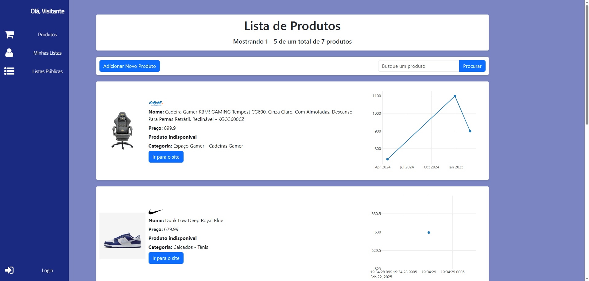
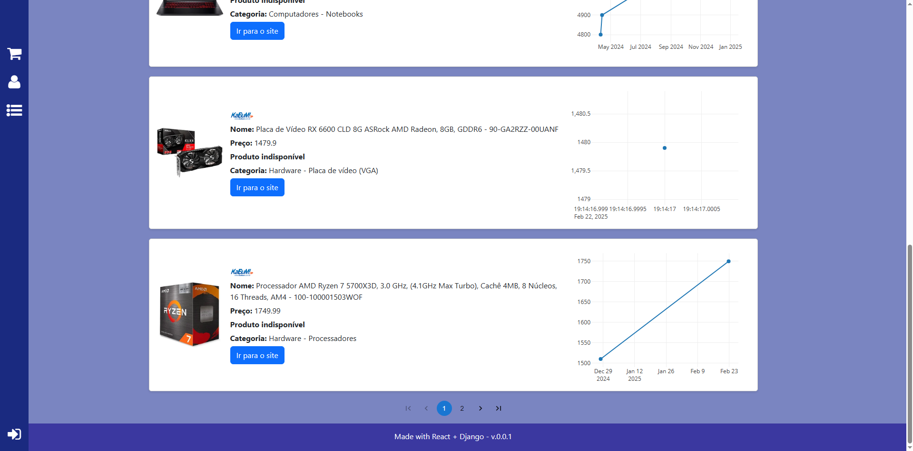

# React Frond End for my-lists

The frontend part of a personal project involving getting data from websites via webscraping, displaying these items to users tracking it's price and allowing users to create lists to help them further with tracking the prices of full list components.

Currently the project is being adapted to a separated front-end/back-end as I'm currently learning React. Most of the features are still under development: The authentication process, the lists page and much more.

# Frontend stack / Tools used:

**React + Vite**: Base framework and build tool.

**Plotly**: For plotting interactive graphs.

**MUI (Material-UI)**: For pagination and UI components.

**Bootstrap**: For CSS styling and layout.

**react-dom**: Needed for rendering React components.

# Screenshots

Home screen

